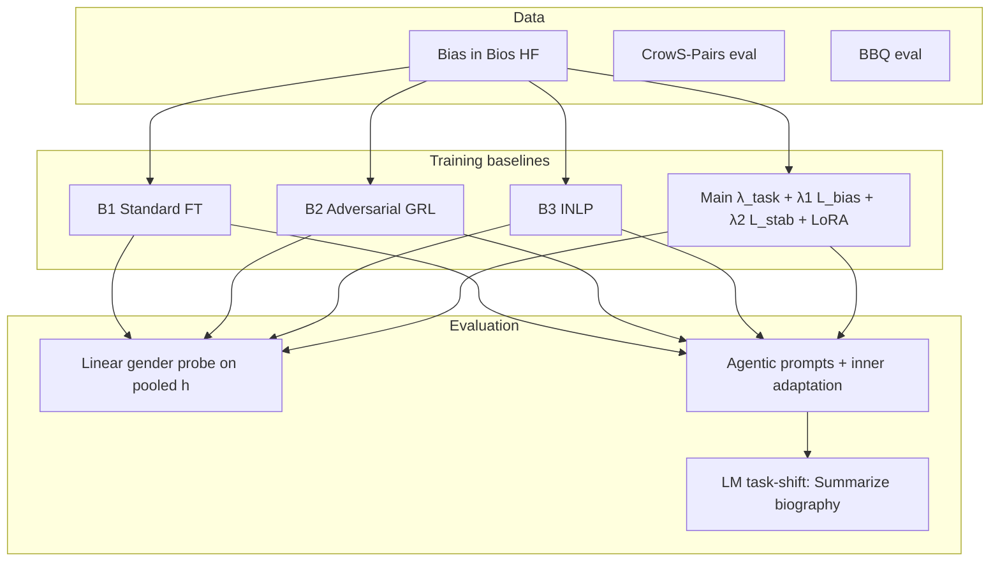

# Mitigating Gender Bias in Occupation Classification from Biographies

**Author:** Pooja Yakkala  
**Course / milestone:** Capstone (Checkpoint 3) — bias evaluation and mitigation on **Bias in Bios** using **Qwen2.5** with baselines (standard, adversarial GRL, INLP) and a **stability-regularized** adversarial **Main** model, plus **agentic** multi-step evaluation and **LM-based task-shift** adaptation.

---

## Project overview

Language models fine-tuned for occupation prediction from biographies can encode **gender** in their representations. This repository provides:

1. **Training / testing** for baselines **B1** (standard CE), **B2** (adversarial debiasing with gradient reversal), **B3** (INLP projection), and **Main** (stability-regularized adversarial + LoRA).
2. **Evaluation:** linear probing (**R(θ)**, excess recoverability **E**), CrowS-Pairs, BBQ, optional LoRA **ΔR**, and **agentic** tables (biography adaptation, multi-step drift).
3. **Data pipeline** for Hugging Face **Bias in Bios** (full data downloaded at runtime; local **schema sample** under `data/samples/`).

### Framework (high-level)



**Figure 1.** Data flow: Bios (and optional eval sets) → baseline trainers → static probes, agentic multi-step evaluation, and optional LM-style adaptation on biographies.

---

## Repository structure

| Path | Purpose |
|------|---------|
| `baselines/` | `b1_standard.py`, `b2_adversarial.py`, `b3_inlp.py`, `main_stability.py` — train each baseline |
| `models/` | `qwen_task.py`, `adversarial.py`, `grl.py` — backbone + debiasing heads |
| `data/` | `bias_in_bios.py`, `loaders.py`, `adaptation_labels.py`, `samples/` — loading, splits, tiny schema sample |
| `evaluation/` | `probe.py`, `metrics.py`, `agentic_report_md.py`, `lm_summarize_adapt.py` — probes, metrics, reports |
| `adaptation/` | `lora_adaptation.py` — short LoRA fine-tune and ΔR |
| `demo/` | `run_demo.py`, `README.md` — **end-to-end tiny split** (B0→Main + agentic tables) |
| `scripts/` | `run_bias_in_bios_stats.py`, `plot_bias_in_bios_data.py` — dataset stats / plots |
| `config.py` | Global defaults (LR, λ, LoRA, agentic adaptation steps, device, paths) |
| `main.py` | Single-baseline Bios runner + CrowS/BBQ + optional LoRA ΔR |
| `run_all_baselines.py` | Full Bios B1–B3 (+ Main optional paths per script), aggregate report |
| `run_agentic_baselines.py` | Agentic evaluation + TABLE 0–5 reports (edit `CONFIG` in `main()`) |
| `results/` | Example **JSON/MD** reports from past runs (regenerate on your machine) |
| `EVALUATION_PROTOCOL.md` | Detailed evaluation steps (static + agentic) |

---

## Environment and dependencies

**Requirements:** Python 3.10+ recommended, CUDA optional (CPU runs possible but slow).

```bash
pip install -r requirements.txt
```

Core packages: `torch`, `transformers`, `datasets`, `peft`, `scikit-learn`, `numpy`, `accelerate`, `tqdm`.

**Device:** Set GPU index in `config.py` (`CUDA_DEVICE_ID`) or use CPU if CUDA is unavailable.

---

## Data preparation

| Dataset | Source | Role |
|---------|--------|------|
| **Bias in Bios** | Hugging Face `LabHC/bias_in_bios` | **Train / val / test** for occupation + gender probing (auto-cached by `datasets`) |
| **CrowS-Pairs** | `nyu-mll/crows_pairs` | Stereotype preference (**eval only**) |
| **BBQ** | `HiTZ/bbq` | Disambiguated QA gap (**eval only**) |

No manual download is required for standard runs: the loaders fetch splits on first access. For the **field layout** without downloading the full corpus, see `data/samples/bias_in_bios_example.json` and `data/samples/README.md`.

**Dataset statistics (optional):**

```bash
python scripts/run_bias_in_bios_stats.py
```

---

## Training and testing — quick commands

### 1) Full baseline sweep (Bias in Bios + CrowS + BBQ)

```bash
python run_all_baselines.py
```

Useful flags: `--quick`, `--epochs N`, `--batch-size N`, `--max-length N`, `--no-lora`, `--model Qwen/Qwen2.5-0.5B`. Outputs: `results/report_*.json`, `results/report_*.md`, updates `results/baseline_comparison.json`.

### 2) Single baseline (compact entry point)

```bash
python main.py --baseline b1
python main.py --baseline b2 --lambda 0.5
python main.py --baseline b3
```

### 3) Agentic evaluation (multi-step + TABLE 0–5)

```bash
python run_agentic_baselines.py
```

Defaults are set in the `CONFIG` `SimpleNamespace` inside `main()` (no CLI). Agentic inner loop uses `DEFAULT_ADAPTATION_STEPS` and `DEFAULT_ADAPTATION_LR` from `config.py`.

### 4) End-to-end demo (tiny split, fast sanity check)

```bash
python demo/run_demo.py
```

See `demo/README.md` for `--cpu`, `--skip-main`, `--adapt-objective`, `--adapt-lm-max-length`, and output paths.

---

## Key results (examples)

Values below are **snapshots** for grading and reporting; **reproduce** with `python run_all_baselines.py` (static sweep) and `python demo/run_demo.py` (agentic demo). Machine-readable copies: `results/baseline_comparison.json`, `demo/output/demo_agentic_report.md` / `.json` after a demo run.

### Static baselines (Bias in Bios subset + CrowS + BBQ)

Representative row from `results/baseline_comparison.json` (run 2026-02-21, controlled split, Qwen2.5-0.5B):

| Model | Task acc % | R(θ) probe | CrowS-Pairs % | BBQ acc % |
|-------|------------|------------|---------------|-----------|
| B1 standard | 100.0 | 0.488 | 51.33 | 29.40 |
| B2 adversarial | 100.0 | 0.531 | 50.07 | 25.43 |
| B3 INLP | 75.0 | 0.494 | 51.92 | 28.91 |

LoRA **ΔR** (that run): **+0.0344** (see JSON for meta).

### Agentic baseline report (demo — tiny split)

Run: `python demo/run_demo.py` (default tiny split: 96 train / 24 val / 32 test; demo mild λ, LM summarize task-shift for TABLE 0 + inner loop). Snapshot below: **2026-04-03** (regenerate locally for exact match).

#### Three claims (paper spine)

| Claim | What to show | Tables |
|-------|----------------|--------|
| **1 — Debiasing works (initially)** | Lower excess recoverability on biography inputs: **E_bio** (B_adv, INLP) **<** B_task | **TABLE 1** |
| **2 — Bias returns** | **TABLE 0:** after task-shift adaptation on bios (default: **LM summarize**), **E_after > E_before**. **TABLE 2–3:** agentic lift + step drift | **TABLE 0** (isolated), **TABLE 2–3** |
| **3 — Main stabilizes** | After **Main**: **E1 ≈ E_bio**, **E3 ≈ E1**, small **ΔE**; task accuracy not collapsed | **TABLE 4** + **TABLE 5** |

#### TABLE 0 — Pure fine-tuning effect (no prompt change)

Same tokenized biographies: extra task loss on the **train** split (**bias head frozen** for B_adv), then re-probe **test** bios for gender (unchanged linear probe on pooled states). **Positive ΔE** on B_adv → representation shift revives recoverable bias under adaptation.

**Default task shift:** causal LM on *“Summarize this biography.”* + biography + short pseudo-summary target; classification heads frozen; backbone (e.g. LoRA) updates; gender probe on pooled **h** unchanged.

| Model | E_before | E_after | ΔE (after − before) |
|-------|----------|---------|----------------------|
| B_task | 1.0 | 0.3469 | −0.6531 |
| B_adv | 0.0204 | 0.3469 | 0.3265 |
| B_static_inlp | 0.0204 | 0.3469 | 0.3265 |

*Generated: 2026-04-03T20:53:13 — Model: Qwen/Qwen2.5-0.5B, cuda:9, seed 42. Bios train=96, val=24, test=32. λ1 (CLI)=0.45 (B_adv/Main train), λ2 (Main)=0.04, INLP k=1.*

#### TABLE 1 — Biography (Claim 1: suppression on training distribution)

| Model | R_bio | E_bio (↓ better) | Notes |
|-------|-------|------------------|-------|
| B_task | 1.0 | 1.0 | High bias (reference) |
| B_adv | 0.5714 | 0.0204 | Adversarial suppression |
| B_static_inlp | 0.5714 | 0.0204 | Static INLP |

*Target:* B_adv / INLP **E_bio** clearly **<** B_task; sweet spot often **0.3 < E_bio < 0.8** (tune `--lambda-bias`, `--inlp-iterations`, or demo `--full-debias`).

#### TABLE 2 — Bias return after agentic step 1 (Claim 2a)

| Model | E_bio | E1 | E1 − E_bio (lift; + = return / shift) |
|-------|-------|-----|----------------------------------------|
| B_task | 1.0 | 0.6735 | −0.3265 |
| B_adv | 0.0204 | 0.3469 | 0.3265 |
| B_static_inlp | 0.0204 | 0.0204 | 0.0 |

*Target:* B_adv with **E1 > E_bio** (positive lift) → bias suppressed on bios but **re-emerges** under agentic prompting + inner adaptation.

#### TABLE 3 — Drift across reasoning steps (Claim 2b)

| Model | E1 | E3 | ΔE = E3 − E1 |
|-------|-----|-----|--------------|
| B_task | 0.6735 | 0.3469 | −0.3265 |
| B_adv | 0.3469 | 0.0204 | −0.3265 |
| B_static_inlp | 0.0204 | 0.0204 | 0.0 |

*Target (paper):* B_adv **ΔE > 0** (bias accumulates step 1 → step 3). *On this tiny split the numbers differ; see full runs under `results/`.*

#### TABLE 4 — Main vs B_adv (Claim 3)

| Model | E_bio | E1 | E3 | ΔE (E3−E1) |
|-------|-------|-----|-----|------------|
| B_adv | 0.0204 | 0.3469 | 0.0204 | −0.3265 |
| Main | 0.0 | 0.0204 | 0.0204 | 0.0 |

#### TABLE 5 — Task utility (final agentic step occupation accuracy %)

| Model | Final step occ. acc % |
|-------|------------------------|
| B_task | 25.0 |
| B_adv | 34.375 |
| B_static_inlp | 9.375 |
| A2_runtime_dynamic_proj | 18.75 |
| Main | 40.625 |

#### Full metric dump (all baselines — demo)

| Baseline | Final Occ Acc % | R1 | R2 | R3 | ΔR | E1 | E2 | E3 | ΔE |
|----------|-----------------|-----|-----|-----|-----|-----|-----|-----|-----|
| B_task | 25.0 | 0.8571 | 0.7143 | 0.7143 | −0.1429 | 0.6735 | 0.3469 | 0.3469 | −0.3265 |
| A2_runtime_dynamic_proj | 18.75 | 0.7143 | 0.7143 | 0.5714 | −0.1429 | 0.3469 | 0.3469 | 0.0204 | −0.3265 |
| B_adv | 34.375 | 0.7143 | 0.5714 | 0.5714 | −0.1429 | 0.3469 | 0.0204 | 0.0204 | −0.3265 |
| B_static_inlp | 9.375 | 0.5714 | 0.5714 | 0.5714 | 0.0 | 0.0204 | 0.0204 | 0.0204 | 0.0 |
| Main | 40.625 | 0.5714 | 0.5714 | 0.5714 | 0.0 | 0.0204 | 0.0204 | 0.0204 | 0.0 |

*R1/R2/R3: raw probe accuracy; E1/E2/E3: excess recoverability; ΔE = E3−E1. Inner adaptation: B_task → L_task on task head; B_adv/Main (LoRA) → L_task on LoRA+task head by default.*

#### Supporting: full biography + lift (demo)

| Baseline | R_bio | E_bio | ROC-AUC | E1−E_bio |
|----------|-------|-------|---------|----------|
| B_task | 1.0 | 1.0 | 1.0 | −0.3265 |
| A2_runtime_dynamic_proj | 1.0 | 1.0 | 1.0 | −0.6531 |
| B_adv | 0.5714 | 0.0204 | 0.6667 | 0.3265 |
| B_static_inlp | 0.5714 | 0.0204 | 0.8333 | 0.0 |
| Main | 0.4286 | 0.0 | 0.6667 | 0.0204 |

---

## Demo / presentation notes (condensed)

- **Part 1 — Data:** `data/bias_in_bios.py`, `data/loaders.py`; stats script above.  
- **Part 2 — Protocol:** `EVALUATION_PROTOCOL.md`.  
- **Part 3 — Models / baselines:** `models/`, `baselines/`.  
- **Part 4 — Results:** `results/baseline_comparison.json`, `results/agentic_report_*.md`, **`demo/output/demo_agentic_report.md`**.

---

## References and acknowledgments

- **Bias in Bios:** De-Arteaga et al., *Bias in Bios: A Case for Intersectional Fairness* ([dataset](https://huggingface.co/datasets/LabHC/bias_in_bios)).  
- **INLP:** Ravfogel et al., *Null It Out: Guarding Protected Attributes by Iterative Nullspace Projection*.  
- **Gradient reversal / adversarial fairness:** Ganin et al., *Domain-Adversarial Training of Neural Networks*; related fair-representation literature.  
- **CrowS-Pairs:** Nangia et al.; **BBQ:** Parrish et al. — benchmark IDs on Hugging Face as used in `data/loaders.py`.  
- **Backbone:** [Qwen2.5](https://huggingface.co/Qwen) (Apache-2.0); **LoRA:** Hugging Face `peft`.  

This project builds on public datasets and open models; implementation code in this repo is written for the capstone unless otherwise noted in file headers.

---

## License

**Project source code** in this repository is licensed under the [MIT License](LICENSE) (permissive, free software).

**Not covered by the MIT License** (use only under their respective terms):

- **Pretrained weights** (e.g. Qwen2.5): see the license on each [Hugging Face model card](https://huggingface.co/Qwen) (Qwen2.5 is typically **Apache-2.0**).
- **Python dependencies** (`torch`, `transformers`, `datasets`, `peft`, etc.): each package’s license on PyPI / GitHub.
- **Datasets** (Bias in Bios, CrowS-Pairs, BBQ): dataset licenses on Hugging Face.
