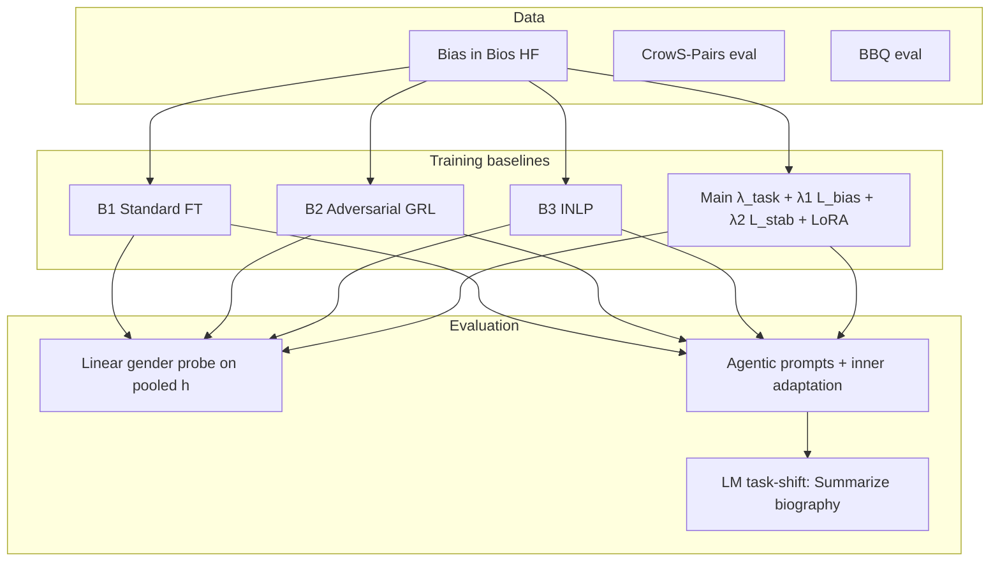
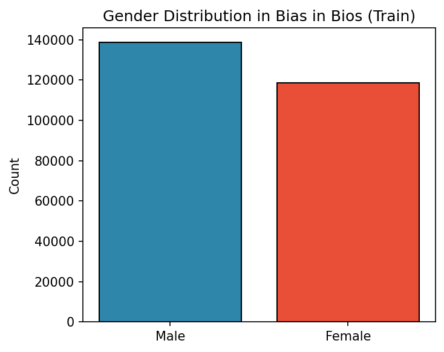
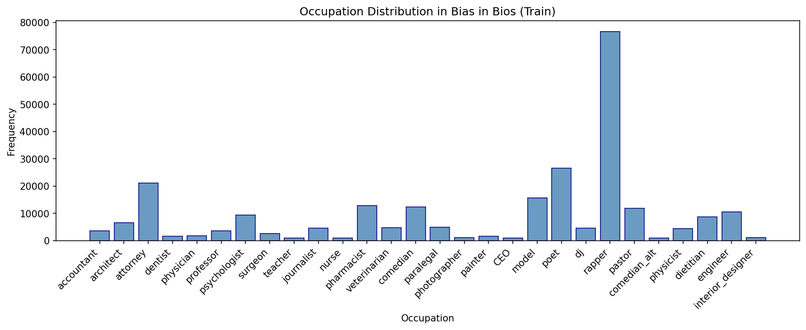

# Mitigating Gender Bias in Occupation Classification from Biographies

**Author:** Pooja Yakkala  
**Course / milestone:** Capstone (Checkpoint 3) — bias evaluation and mitigation on **Bias in Bios** using **Qwen2.5** with baselines (standard, adversarial GRL, INLP) and a **stability-regularized** adversarial **Main** model, plus **agentic** multi-step evaluation and **LM-based task-shift** adaptation.

---

## Project overview

Language models fine-tuned for occupation prediction from biographies can encode **gender** in their representations. This repository provides:

1. **Training / testing** for baselines **B1** (standard CE), **B2** (adversarial debiasing with gradient reversal), **B3** (INLP projection), and **Main** (stability-regularized adversarial + LoRA).
2. **Evaluation:** linear probing (**R(θ)**, excess recoverability **E**), CrowS-Pairs, BBQ, optional LoRA **ΔR**, and **agentic** tables (biography adaptation, multi-step drift).
3. **Data pipeline** for Hugging Face **Bias in Bios** (full data downloaded at runtime; local **schema sample** under `data/samples/`).

### Framework (high-level)



**Figure 1.** Data flow: Bios (and optional eval sets) → baseline trainers → static probes, agentic multi-step evaluation, and optional LM-style adaptation on biographies.

---

## Repository structure

| Path | Purpose |
|------|---------|
| `baselines/` | `b1_standard.py`, `b2_adversarial.py`, `b3_inlp.py`, `main_stability.py` — train each baseline |
| `models/` | `qwen_task.py`, `adversarial.py`, `grl.py` — backbone + debiasing heads |
| `data/` | `bias_in_bios.py`, `loaders.py`, `adaptation_labels.py`, `samples/` — loading, splits, tiny schema sample |
| `evaluation/` | `probe.py`, `metrics.py`, `agentic_report_md.py`, `lm_summarize_adapt.py` — probes, metrics, reports |
| `adaptation/` | `lora_adaptation.py` — short LoRA fine-tune and ΔR |
| `demo/` | `run_demo.py`, `README.md` — **end-to-end tiny split** (B0→Main + agentic tables) |
| `scripts/` | `run_bias_in_bios_stats.py`, `plot_bias_in_bios_data.py` — dataset stats / plots |
| `config.py` | Global defaults (LR, λ, LoRA, agentic adaptation steps, device, paths) |
| `main.py` | Single-baseline Bios runner + CrowS/BBQ + optional LoRA ΔR |
| `run_all_baselines.py` | Full Bios B1–B3 (+ Main optional paths per script), aggregate report |
| `run_agentic_baselines.py` | Agentic evaluation + TABLE 0–5 reports (edit `CONFIG` in `main()`) |
| `results/` | Reports (**JSON/MD**), **`figures/`** (dataset distributions, e.g. gender / occupation PNGs) |
| `EVALUATION_PROTOCOL.md` | Detailed evaluation steps (static + agentic) |

---

## Environment and dependencies

**Requirements:** Python 3.10+ recommended, CUDA optional (CPU runs possible but slow).

```bash
pip install -r requirements.txt
```

Core packages: `torch`, `transformers`, `datasets`, `peft`, `scikit-learn`, `numpy`, `accelerate`, `tqdm`.

**Device:** Set GPU index in `config.py` (`CUDA_DEVICE_ID`) or use CPU if CUDA is unavailable.

---

## Data preparation

| Dataset | Source | Role |
|---------|--------|------|
| **Bias in Bios** | Hugging Face `LabHC/bias_in_bios` | **Train / val / test** for occupation + gender probing (auto-cached by `datasets`) |
| **CrowS-Pairs** | `nyu-mll/crows_pairs` | Stereotype preference (**eval only**) |
| **BBQ** | `HiTZ/bbq` | Disambiguated QA gap (**eval only**) |

No manual download is required for standard runs: the loaders fetch splits on first access. For the **field layout** without downloading the full corpus, see `data/samples/bias_in_bios_example.json` and `data/samples/README.md`.

**Dataset statistics (optional):**

```bash
python scripts/run_bias_in_bios_stats.py
```

### Dataset distributions (figures)

Committed plots under **`results/figures/`** (Bias in Bios, predefined splits; counts depend on caps when the script ran).

**Gender (train)** — `results/figures/gender_distribution.png`

<p align="center">
  
</p>

**Occupation (train, 28 classes)** — `results/figures/occupation_distribution.png`

<p align="center">
  
</p>

*If images do not show in the editor preview, open the PNG paths above in the file tree, or view the README on GitHub after pushing (remote rendering resolves the same paths).*

**Regenerate plots** (default output names: `bias_in_bios_split_sizes.png`, `bias_in_bios_gender_train.png`, `bias_in_bios_occupation_train.png` in `results/figures/`):

```bash
python scripts/plot_bias_in_bios_data.py
python scripts/plot_bias_in_bios_data.py --out results/figures --bios-train-max 10000
```

---

## Training and testing — quick commands

### 1) Full baseline sweep (Bias in Bios + CrowS + BBQ)

```bash
python run_all_baselines.py
```

Useful flags: `--quick`, `--epochs N`, `--batch-size N`, `--max-length N`, `--no-lora`, `--model Qwen/Qwen2.5-0.5B`, `--skip-agentic-report` (skips TABLE 0–5 reload/eval). Outputs: `results/report_*.json`, `results/report_*.md`, `results/baseline_comparison.json`, and **`results/agentic_report_all_baselines_*.md`** + **`.json`** (same sections as `run_agentic_baselines.py`: three claims, TABLE 0–5, full dump, supporting biography table).

### 2) Single baseline (compact entry point)

```bash
python main.py --baseline b1
python main.py --baseline b2 --lambda 0.5
python main.py --baseline b3
```

### 3) Agentic evaluation (multi-step + TABLE 0–5)

```bash
python run_agentic_baselines.py
```

Defaults are set in the `CONFIG` `SimpleNamespace` inside `main()` (no CLI). Agentic inner loop uses `DEFAULT_ADAPTATION_STEPS` and `DEFAULT_ADAPTATION_LR` from `config.py`. Writes `results/agentic_report_*.md` / `.json` with the **same markdown structure** as the demo / `run_all_baselines` agentic bundle (title line differs: *run_agentic_baselines* vs *run_all_baselines*).

### 4) End-to-end demo (tiny split, fast sanity check)

```bash
python demo/run_demo.py
```

See `demo/README.md` for `--cpu`, `--skip-main`, `--adapt-objective`, `--adapt-lm-max-length`, and output paths.

---

## Key results (light)

**Paper spine (three claims):** (1) lower **E_bio** on biographies after debiasing vs B_task; (2) bias can **return** after LM task-shift on bios (TABLE 0) and under agentic steps (TABLE 2–3); (3) **Main** keeps **E1 ≈ E3** (small trajectory ΔE) without collapsing task accuracy. Full TABLE 0–5 + metric dumps → generated `.md` next to each `.json` below.

### Static baselines (CrowS / BBQ snapshot)

From `results/baseline_comparison.json` (2026-02-21-style run): B1/B2 ~100% occ. acc; B3 lower; R(θ) ~0.49–0.53; LoRA ΔR example **+0.0344**. Regenerate with `python run_all_baselines.py`.

### Agentic — full split (committed snapshot)

**Files:** [JSON](results/agentic_report_20260403_122754.json) · [Markdown](results/agentic_report_20260403_122754.md) (same run).  
**Setup:** Bios train=4000, val=1000, test=2000 · Qwen2.5-0.5B · cuda:9 · seed 42 · epochs 3 · batch 8 · max_length 256 · λ1=1.5, λ2=0.1 · B2 LoRA r=16, α=32 · adaptation_steps=4, adaptation_lr=1e-4.

| Model | E_bio | E1 | E3 | ΔE (E3−E1) | Final occ. acc % |
|-------|-------|-----|-----|------------|------------------|
| B_task | 0.8783 | 0.9779 | 0.9668 | −0.0111 | 86.45 |
| B_adv | 0.823 | 0.8009 | 0.7677 | −0.0332 | 65.65 |
| B_static_inlp | 0.9004 | 0.9723 | 0.9779 | +0.0055 | 68.45 |
| Main | 0.7013 | 0.5741 | 0.5741 | 0.0 | 73.9 |

**TABLE 0 (LM summarize on bios, ΔE_bio):** B_task −0.0166 · B_adv −0.0221 · B_static_inlp 0.0 · Main +0.0222 — see `table0_pure_bio_task_ft` in the JSON.

### Agentic — demo (tiny split, quick)

**Files:** `demo/output/demo_agentic_report.json` / `.md` after `python demo/run_demo.py` (default **96 / 24 / 32** bios, milder λ). Full tables in those files; **excerpt** (same metrics as above):

| Model | E_bio | Final occ. acc % |
|-------|-------|------------------|
| B_task | 1.0 | 25.0 |
| B_adv | 0.0204 | 34.375 |
| B_static_inlp | 0.0204 | 9.375 |
| Main | 0.0 | 40.625 |

---

## Demo / presentation notes (condensed)

- **Part 1 — Data:** `data/bias_in_bios.py`, `data/loaders.py`; stats script above.  
- **Part 2 — Protocol:** `EVALUATION_PROTOCOL.md`.  
- **Part 3 — Models / baselines:** `models/`, `baselines/`.  
- **Part 4 — Results:** `results/baseline_comparison.json`, **`results/agentic_report_20260403_122754.md`**, `demo/output/demo_agentic_report.md`.

---

## References and acknowledgments

- **Bias in Bios:** De-Arteaga et al., *Bias in Bios: A Case for Intersectional Fairness* ([dataset](https://huggingface.co/datasets/LabHC/bias_in_bios)).  
- **INLP:** Ravfogel et al., *Null It Out: Guarding Protected Attributes by Iterative Nullspace Projection*.  
- **Gradient reversal / adversarial fairness:** Ganin et al., *Domain-Adversarial Training of Neural Networks*; related fair-representation literature.  
- **CrowS-Pairs:** Nangia et al.; **BBQ:** Parrish et al. — benchmark IDs on Hugging Face as used in `data/loaders.py`.  
- **Backbone:** [Qwen2.5](https://huggingface.co/Qwen) (Apache-2.0); **LoRA:** Hugging Face `peft`.  

This project builds on public datasets and open models; implementation code in this repo is written for the capstone unless otherwise noted in file headers.

---

## License

**Project source code** in this repository is licensed under the [MIT License](LICENSE) (permissive, free software).

**Not covered by the MIT License** (use only under their respective terms):

- **Pretrained weights** (e.g. Qwen2.5): see the license on each [Hugging Face model card](https://huggingface.co/Qwen) (Qwen2.5 is typically **Apache-2.0**).
- **Python dependencies** (`torch`, `transformers`, `datasets`, `peft`, etc.): each package’s license on PyPI / GitHub.
- **Datasets** (Bias in Bios, CrowS-Pairs, BBQ): dataset licenses on Hugging Face.
